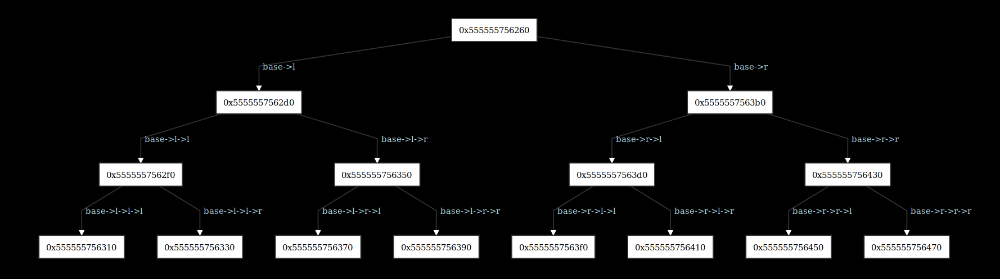
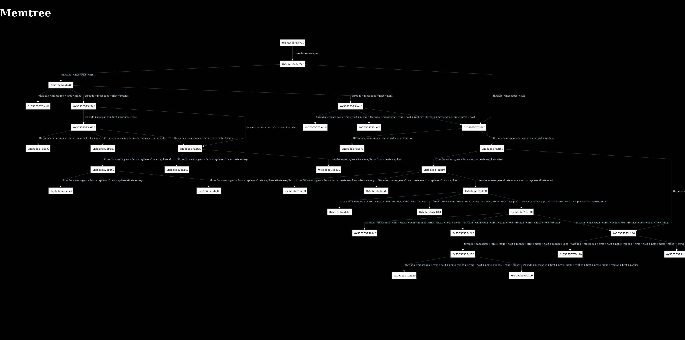

# Memtree


## What is it?

This project aims to integrate with gdb, so that from the commandline you can visually inspect data-structures.

The aim is to get it to be useful in teaching, and demonstrating errors in student code.

## Basic Design Tenents

#### This program should run without any linking into the compiled C program (though that program will need debug info)

This is because making a drop-in solution, especially in a large environment like UNSW CSE is hard to do. It requires
manipulating existing tools, or making life harder for students by instructing them to perform additional steps.

It also increases the surface area for bugs or incompatibility issues.

## How do I install it?

The code isn't fully set-up yet, so there's no simple install script.

That said, if you have some C code (for instance, the code in `example/tree/`), you can use a one-liner like:

```sh
$ <your-c-compiler> -g -o program <file>.c
$ gdb -q -ex="source ~/<path-to-memtree>/gdb_ext/gdb_commands.py" -ex="b main" -ex="r" ./tree
...
(gdb) jserve <variable>
```

which is equivalent to:
```
$ <your-c-compiler> -g -o program <file>.c
$ gdb ./tree
...
(gdb) source ~/<path-to-memtree>/gdb_ext/gdb_commands.py
...
(gdb) break main
(gdb) run
(gdb) jserve <variable>

```

## How do I use it?

Go to the webserver (probably at `0.0.0.0:8000`) and look around!

## Examples



(note, the second image had some custom code. The ability to do this manually is a TODO)
